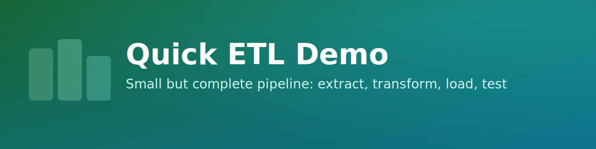
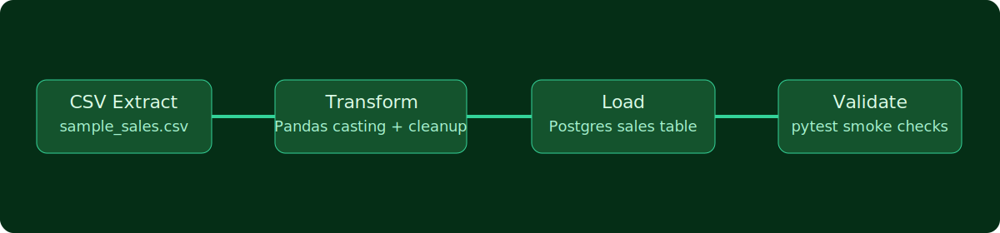

# Quick ETL Demo

A compact, end to end ETL sample that loads CSV sales data into Postgres, with tests and operations docs included.

## Highlights
- Extract: reads from `sample_sales.csv`.
- Transform: normalizes data with Pandas.
- Load: writes into Postgres table `sales`.
- Validation: includes `pytest` coverage.
- Documentation: includes runbook and RTM mapping.

## Repo Layout
- `etl/load_sales.py` ETL entrypoint.
- `tests/test_load.py` smoke test for row loading.
- `runbook.md` run and recovery procedures.
- `RTM.csv` requirement traceability matrix.

## Prerequisites
- Python 3.10+
- Local Postgres database named `etl_demo`

## Run
```bash
python3 -m venv .venv
source .venv/bin/activate
pip install -r requirements.txt
python etl/load_sales.py
pytest -q
```

## Pipeline Flow

